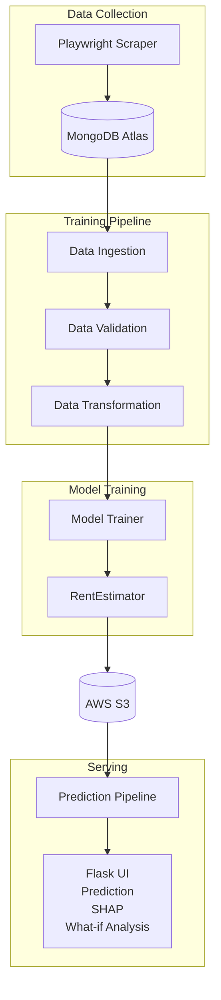

#🏙️ Mumbai Rent Intelligence

An end-to-end machine learning system that constructs a dataset from live Mumbai rental listings, models the fair market rent of a given flat, explains the drivers behind each prediction, and supports interactive trade-off analysis. The system is served through a production-oriented MLOps pipeline spanning data acquisition, validation, model development, deployment, and explainable inference.

---

## 🎯 Business Problem

Rental pricing in Mumbai is opaque and inconsistent. Comparable units within the same locality are frequently listed at significantly different rents, leaving both tenants and landlords without a reliable reference for fair market value.

Proptech platforms (NoBroker, Housing, MagicBricks) and the analytics teams supporting them require an answer to a recurring question: what is the fair rent for a given property, and which listings are mispriced?

A model addressing this problem supports several decisions:

- **Tenant-facing:** identifying listings priced above fair market value for their size and locality.
- **Landlord-facing:** detecting properties priced below comparable listings.
- **Analytics/consulting:** surfacing localities that are systematically over- or under-priced relative to the market.

This repository implements a complete, deployed system addressing this problem.

---

## 🏆 Headline Results

| Metric | Value |
|---|---|
| **Cross-validated R²** (rupee scale) | **0.957** |
| **Tuned XGBoost test R²** | **0.969** |
| **Mean absolute error** | **~₹11,000/month** (≈12% of median rent) |
| **Real-world validation** | Predicted **₹82,000** on a live listing renting for **₹85,000** — a **3.5% error** |
| **Dataset** | **~5,900 self-scraped listings**, deduplicated to **3,659 unique records** |

Real-world validation complements standard evaluation metrics. In addition to evaluation on held-out test data, the trained model was validated against an unseen live listing, achieving a prediction error of 3.5%.

---

## ✨ Key Features

- Custom dataset constructed by scraping live MagicBricks listings with Playwright, including `robots.txt` compliance.
- End-to-end MLOps pipeline built on MongoDB Atlas, AWS S3, and Flask.
- YAML-driven hyperparameter tuning executed through `GridSearchCV`.
- SHAP-based explainability providing per-prediction transparency.
- Real-world validation against unseen live listings, in addition to held-out test evaluation.
- Interactive Flask interface supporting live "what-if" analysis and a fair-price comparison.
- Duplicate detection and leakage prevention integrated into the validation process.
- Automated training and prediction pipelines connected through an S3 model registry.

---

## 💡 What Makes This Project Different

The dataset was constructed specifically for this problem rather than sourced from an existing repository.

| Capability | Description |
|---|---|
| 🕷️ **Live web scraping** (Playwright) | Dataset construction from a JavaScript-rendered site with anti-bot measures, under `robots.txt` constraints |
| 🧭 **robots.txt compliance** | Only permitted result pages were scraped; disallowed `proptype=` URLs were identified and avoided |
| 🗺️ **Geospatial feature engineering** | Distance-to-metro and nearby-amenity features derived from unstructured text |
| 📊 **Rigorous EDA** | Univariate, bivariate, outlier, and multicollinearity (VIF) analysis supporting each feature decision |
| 🔬 **Honest validation** | An inflated R² was traced to duplicate leakage across the train/test split, corrected, and confirmed leakage-free via a target-scramble test |
| 🎛️ **YAML-driven tuning** | Model definitions and hyperparameter grids configured in `model.yaml` and tuned with `GridSearchCV` |
| 🧠 **Explainability (SHAP)** | Per-prediction breakdowns mapped from 44 encoded columns back to approximately 10 human-readable factors |
| 🚀 **Full MLOps** | MongoDB → validation → transformation → training → S3 model registry → Flask serving |

---

## 🔎 Dataset Construction

No public dataset was available for this problem. A custom dataset was therefore constructed from live rental listings. Building the dataset required addressing several engineering challenges:

- **JavaScript rendering.** MagicBricks loads pricing data through JavaScript, so static requests returned empty pages. Playwright was used to drive a real browser and wait for content to render before extraction.
- **robots.txt compliance.** The general search URL included a disallowed `proptype=` parameter. Individual property-type and locality URLs (e.g. `flats-for-rent-in-powai-mumbai-pppfr`) were permitted and used exclusively.
- **Per-URL result limit.** Each URL returned approximately 59 listings. To scale collection, roughly 160 URLs were generated programmatically across localities, BHK counts, and property types, with global deduplication and cross-run safeguards to prevent duplicate records.
- **Politeness and resilience.** Randomized 2–5 second delays, incremental scrolling, per-listing error handling, and incremental CSV writes were implemented to reduce load on the source and prevent data loss on interruption.

All fields — rent, area, floor, furnishing, facing, overlooking, and nearby landmarks — were parsed from raw, inconsistent text such as `"2.1 Lac"`, `"3 out of 20"`, and `"Andheri metro station - 6 Minutes"`.

---

## 📈 Consulting Insights (from EDA)

The analysis produces market-level findings in addition to the predictive model:

- **🗺️ Locality price map.** Median price-per-sqft ranks Worli (~₹250/sqft), Bandra West (~₹200), and Bandra East (~₹192) highest, with the far suburbs (Mira Road, Mulund, Borivali) lowest — a 2×+ premium for the central belt. Location is the largest single driver of rent.
- **📐 Area and bedrooms.** Carpet area alone explains approximately 72% of rent variance, and BHK count explains approximately 57% independently. Substantial within-locality spread indicates that a multi-feature model outperforms any location-only rule.
- **🛋️ Furnishing premium.** Furnished units command a measurable premium over unfurnished units when controlling for size.
- **🚇 Metro proximity.** Listings closer to a metro station rent higher where the distance is reported; a `has_metro` flag captures the approximately 80% of records where proximity was not reported.
- **🏙️ Within-locality variability.** Premium areas (Worli, Bandra West) show wide price spreads reflecting mixed luxury and standard stock, whereas suburban localities are more homogeneous.

---

## 🧪 Validation and Reliability

The reported performance was verified through multiple validation procedures designed to eliminate leakage and overly optimistic evaluation.

1. **Cross-validation.** An initial R² of approximately 0.97 was treated as potentially optimistic and evaluated with 5-fold cross-validation.
2. **Leakage identification and correction.** Cross-validation results were stable but inflated. 1,356 duplicate listings — scraped under multiple URLs — were leaking across the train/test split. Deduplication produced a corrected R² of 0.957.
3. **Leakage confirmation.** A target-scramble test (shuffling the target and retraining) reduced R² to a negative value, confirming that the model learns genuine signal rather than exploiting leakage. A dummy baseline confirmed the evaluation procedure was not inflated.
4. **Calibration check.** Because the model predicts `log(rent)`, the log-to-rupee back-transformation was checked for bias. The smearing factor was approximately 1.00, indicating negligible retransformation bias across the price range.
5. **Real-world validation.** The model was evaluated against a live listing (₹82,000 predicted vs ₹85,000 actual). An earlier over-prediction was diagnosed as a carpet-area versus built-up-area input mismatch rather than a model error.

Together, these procedures reduce the risk of leakage and optimistic evaluation, increasing confidence that the reported metrics reflect genuine generalization.

---



The training pipeline and the web application communicate only through S3: training writes the model, and the application reads it. The two components run independently.

---

## 🤖 Modelling

Six models were compared on identical, leakage-free splits:

| Model | Role |
|---|---|
| Linear / Ridge / Lasso | Interpretable baselines |
| Random Forest | Tree ensemble |
| **XGBoost** ⭐ | Best-performing model, tuned via `model.yaml` |
| LightGBM | Gradient boosting |

Feature engineering decisions were supported by the analysis:

- The target is modelled as `log(rent)` due to right skew, then inverted to rupees for metric reporting.
- One-hot encoding is applied to locality, property type, and facing; ordinal encoding is applied to furnishing based on its natural order.
- KNN imputation handles continuous gaps (area, floor); scaling is applied only to scale-sensitive models.
- `floor_num` was removed after a VIF analysis and drop-test showed redundancy with `floor_ratio`.
- Hyperparameter tuning is driven entirely by `config/model.yaml`, keeping search grids in configuration rather than code.

---

## 🖥️ Application

A three-page Flask application:

1. **Home** — a landing page with a background hero and a scrolling sample-listings strip.
2. **Predict** — property details, optional preference toggles, and an optional asking-rent field.
3. **Result** — four decision-support components:
   - 💰 Fair rent estimate with a confidence range.
   - 📊 "Why this price" — a SHAP breakdown of each factor's positive or negative rupee contribution.
   - ⚖️ Fair-price comparison against a user-provided asking rent.
   - 🎚️ What-if analysis — controls that re-predict rent in response to changes in inputs.

A Market Insights page presents the locality price-per-sqft ranking.

---

## 📁 Repository Structure

```
├── src/
│   ├── scraper/                 # Playwright scraper + URL generator
│   ├── data_access/             # MongoUploader, RentData (Mongo -> DataFrame)
│   ├── configuration/           # MongoDB + AWS S3 clients
│   ├── cloud_storage/           # S3 storage + sync
│   ├── component/               # ingestion, validation, transformation, trainer
│   ├── model/                   # estimator (RentModel), s3_estimator, shap_explainer
│   ├── pipeline/                # training_pipeline, prediction_pipeline
│   ├── constant/  utils/  exception/  logger.py
├── config/
│   ├── schema.yaml              # raw-data validation contract
│   ├── prediction_schema.yaml   # UI input contract (required/optional/derived)
│   └── model.yaml               # hyperparameter search grids
├── notebooks/                   # EDA, cleaning, model comparison
├── templates/  static/          # Flask UI (HTML/CSS/JS)
├── app.py                       # Flask app
└── requirements.txt
```

---

## 🚀 Quickstart

```bash
# 1. Install
pip install -r requirements.txt
playwright install chromium

# 2. Set environment variables (.env)
#    MONGO_DB_URL, AWS_ACCESS_KEY_ID, AWS_SECRET_ACCESS_KEY, REGION_NAME

# 3. Train (uploads to Mongo -> trains -> pushes model to S3)
python -m src.pipeline.training_pipeline

# 4. Serve
python app.py           # -> http://127.0.0.1:5000
```

---

## 🛠️ Tech Stack

**Data & scraping:** Playwright · BeautifulSoup · pandas · MongoDB Atlas
**ML:** scikit-learn · XGBoost · LightGBM · SHAP · statsmodels (VIF)
**MLOps & serving:** AWS S3 · Flask · YAML-driven config · custom logging & exceptions

---

## 🧭 Future Work

- Quantile regression to provide a statistically rigorous confidence interval, replacing the current illustrative range.
- Scheduled re-scraping (AWS Lambda + EventBridge) with Evidently-based drift monitoring.
- Extension to Pune and Bangalore to support a cross-city model.

---

An end-to-end machine learning system spanning data acquisition, validation, model development, deployment, and explainable inference.
